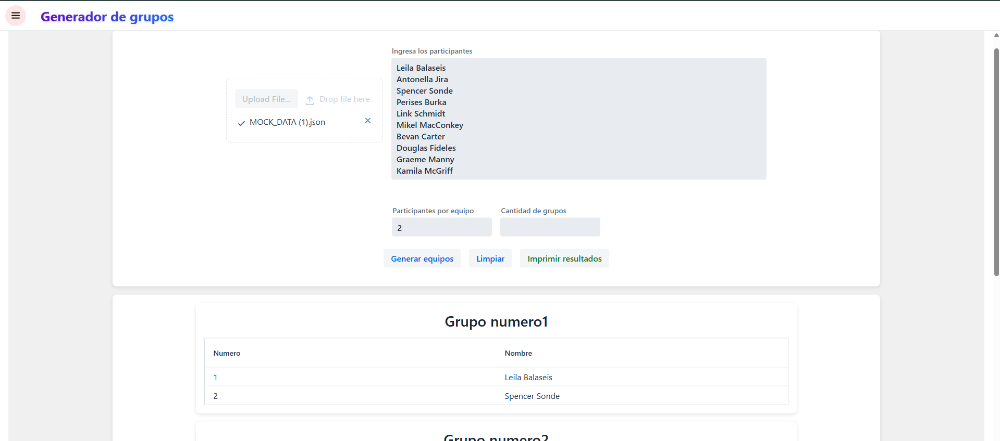
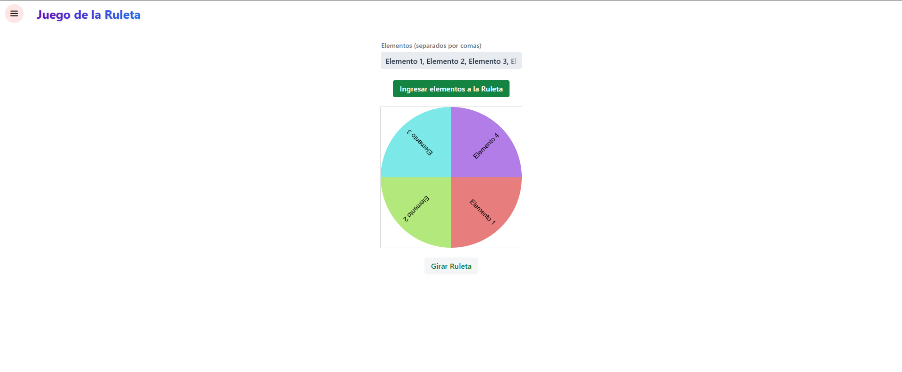
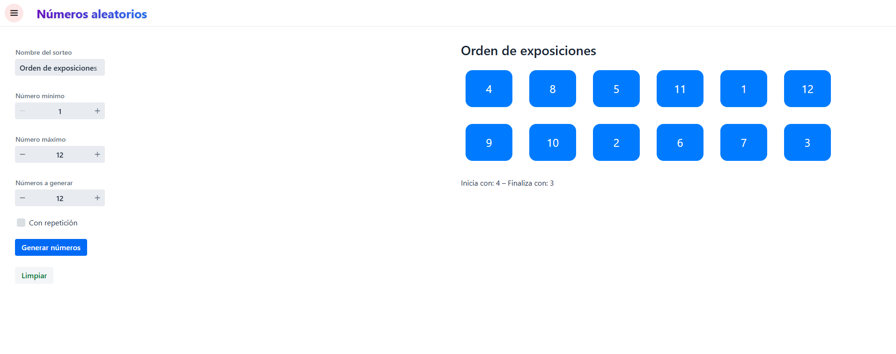
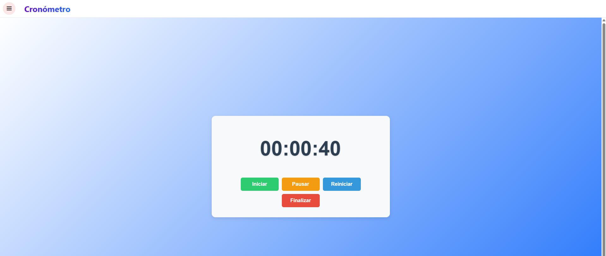
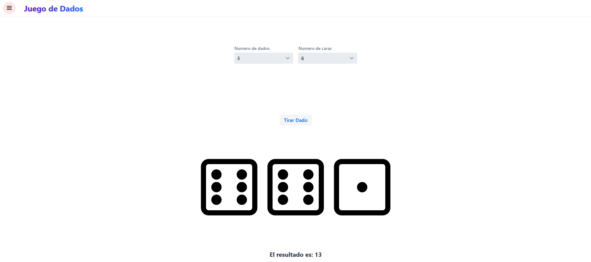
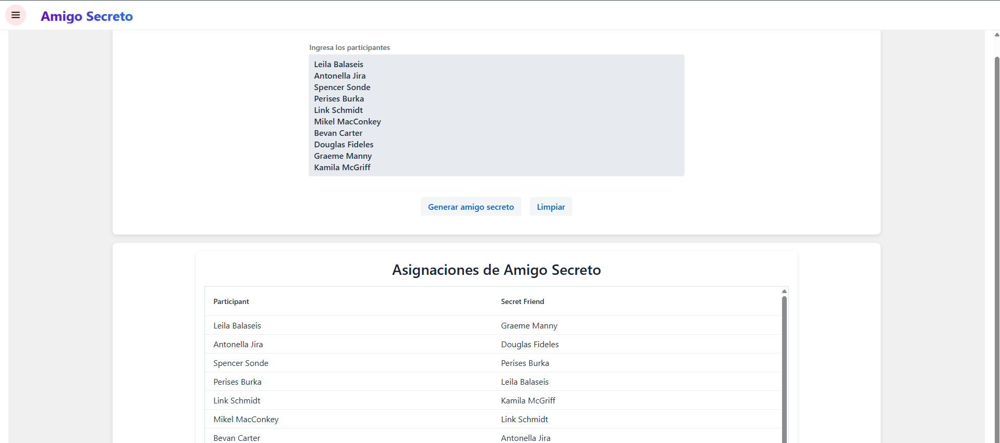

# APSO
``` text
APSO es una plataforma web diseñada para asistir a docentes universitarios en la gestión
de actividades de aula mediante herramientas interactivas y juegos educativos. El proyecto 
integra funcionalidades de generación aleatoria para sorteo de actividades, formación de 
grupos y otras dinámicas de clase.
```

## **Características Principales**

### **Herramientas Interactivas**

1. **Generador de Grupos**
    - Crea grupos aleatorios con tamaño personalizable
    - Entrada manual de participantes o importación desde JSON
    - Exportación de grupos en un archivo PDF

2. **Ruleta de Selección**
    - Ruleta personalizable
    - Selección aleatoria

3. **Cronómetro**
    - Temporizador
    - Se peude pausar y continuar el temporizador

4. **Lanzamiento de Moneda**
    - Toma decisiones binarias de manera aleatoria
    - Animación interactiva

5. **Lanzamiento de Dados**
    - Simulador de dados
    - Opción para múltiples dados simultáneos

6. **Amigos Secretos**
    - Organiza intercambios de regalos
    - Asignación aleatoria

7. **Generador de Números**
    - Produce secuencias numéricas aleatorias
    - Personalización de rango (mínimo/máximo)
    - Opción para evitar repeticiones

### **Seguridad y Acceso**

- Autenticación con Auth0
- Login mediante Google OAuth
- Gestión de roles de usuario
- Protección de rutas basada en permisos

## **Tecnologías Utilizadas**

| **Categoría** | **Tecnologías** |
| --- | --- |
| **Frontend** | Vaadin 24+, HTML5, CSS, JavaScript, LitElement |
| **Backend** | Java 17+, Spring Boot, JPA (Hibernate) |
| **Base de Datos** | PostgreSQL 16+ |
| **Autenticación** | Auth0, OAuth 2.0, Google Sign-In |
| **Herramientas** | Maven, Git, Docker |
| **Despliegue** | Neon, Render|

## **Cómo Empezar**

### **Prerrequisitos**

- Java JDK 17+
- PostgreSQL 16+
- Maven 3.8+
- Cuenta de [Auth0](https://auth0.com/) (gratuita)

### **Instalación**

1. **Clonar repositorio:**
    
    ```bash
    git clone https://github.com/rp23005/APSO.git
    cd APSO
    ```
    
2. **Configurar base de datos:**
    - Crear una base de datos PostgreSQL llamada **`apso_db`**
    - Configurar credenciales en **`src/main/resources/application.properties`**:
        
        ```text
        spring.datasource.url=jdbc:postgresql://localhost:5432/apso_db
        spring.datasource.username=tu_usuario
        spring.datasource.password=tu_contraseña
        ```
        
3. **Configurar Auth0:**
    - Crear una aplicación en el [dashboard de Auth0](https://manage.auth0.com/)
    - Configurar variables en **`application.properties`**:
        
        ```text
        auth0.domain=tu-dominio.auth0.com
        auth0.clientId=tu-client-id
        auth0.clientSecret=tu-client-secret
        auth0.audience=tu-audience
        ```
        
4. **Compilar y ejecutar:**
    
    ```bash
    mvn clean package
    mvn spring-boot:run
    ```
    
5. **Acceder a la aplicación:**
    
    
    ```bash
    http://localhost:8080
    ```
    

## **Capturas de Pantalla**

<div style="display: flex; flex-wrap: wrap; gap: 20px; justify-content: center;">

## **Vista general**


### 1. Generador de Grupos


### 2. Ruleta


### 3. Numeros aleatorios


### 4. Cronómetro


### 5. Dados


### 6. Moneda


### 7. Amigo secreto


</div>

## **Licencia**

Este proyecto está bajo la Licencia MIT - ver el archivo [LICENSE](https://github.com/rp23005/APSO/blob/main/LICENSE.md) para más detalles.

## **Contacto**

- **Autores:**
    1. Kevin Martínez
    2. Jennifer Pleitez
    3. Isaí Rivera
    4. Noel Hernández
    5. Héctor Echegoyen
- **Repositorio:** https://github.com/rp23005/APSO
- **Problemas:** [Reportar un issue](https://github.com/rp23005/APSO/issues)

---

**APSO** © 2025 - Proyecto Universitario | Herramientas docentes innovadoras